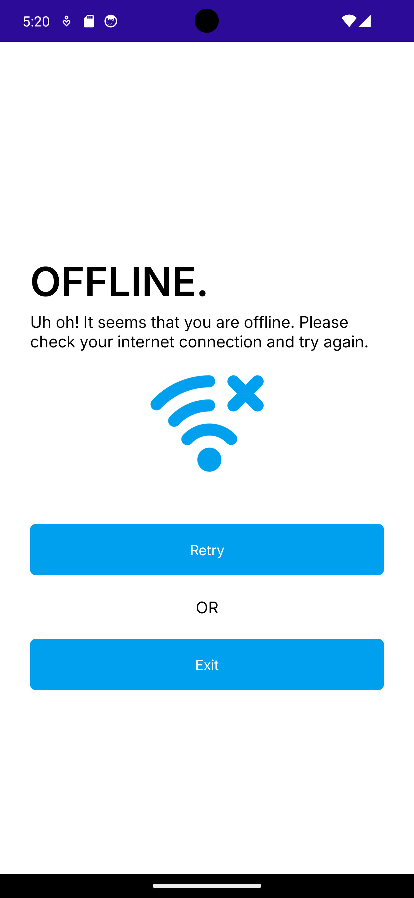
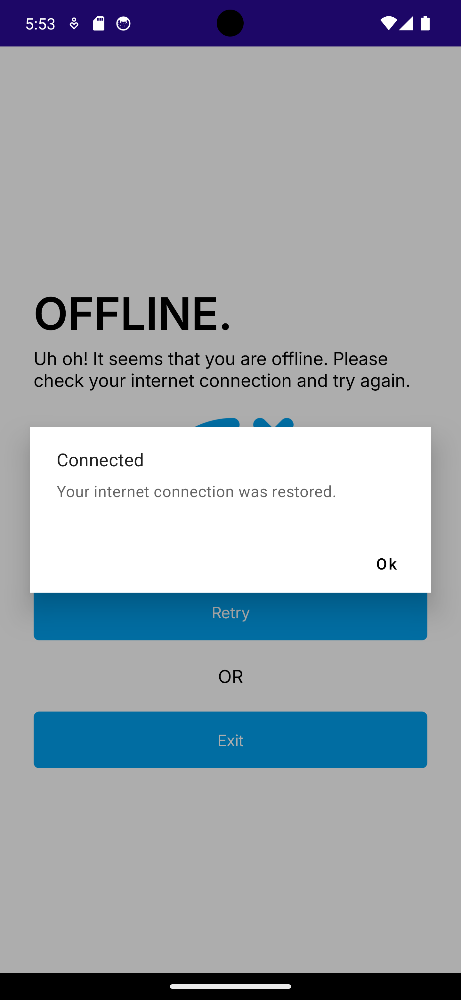
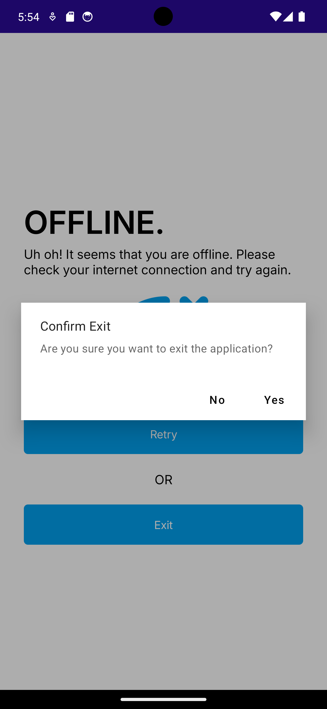
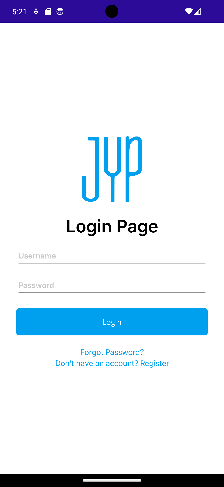
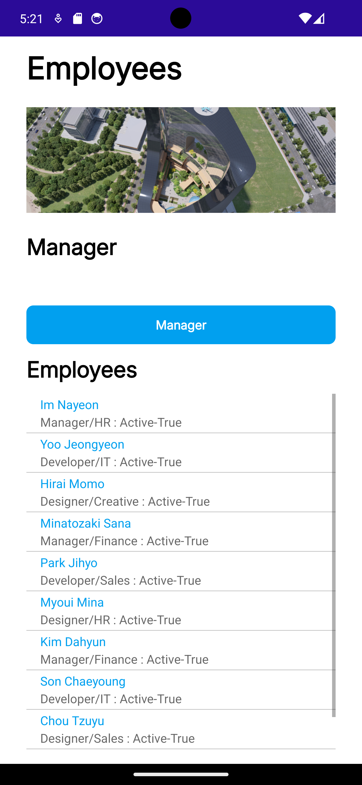

# Module 03 - Exercise 01 (PDC50-LAB)

    Name of Student: Elmalia Jane S. Diaz
    Year and Section: BSIT4A
    Activity Title: Module 03 - Exercise 01
    Date Submitted: September 04, 2024

## Employee View App with Platform-Specific Configuration and Application Lifecycle Management
### Source Code
- [OfflinePage.xaml](Module03Exercise01/View/OfflinePage.xaml)
- [OfflinePage.xaml.cs](Module03Exercise01/View/OfflinePage.xaml.cs)
- [LoginPage.xaml](Module03Exercise01/View/LoginPage.xaml)
- [LoginPage.xaml.cs](Module03Exercise01/View/LoginPage.xaml.cs)

## Offline Page (Offline)
### Output Screenshot

    

## Offline Page (Retry and Exit)
### Output Screenshot

    
    

## Login Page (Online)
### Output Screenshot

    

## Employees Page
### Output Screenshots
- This page will be displayed after clicking the Login button on the Login page.

    
    

